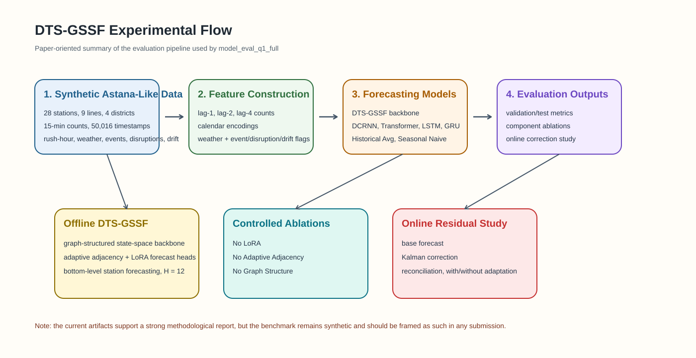
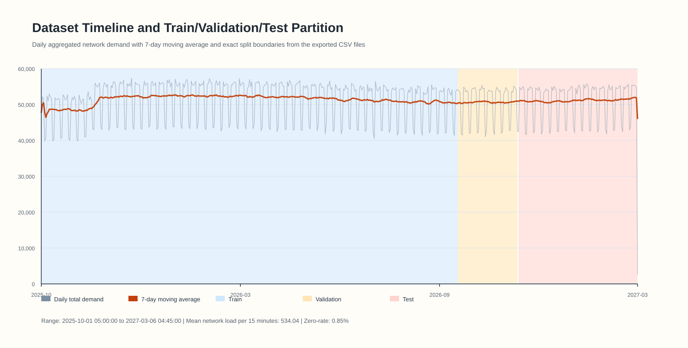
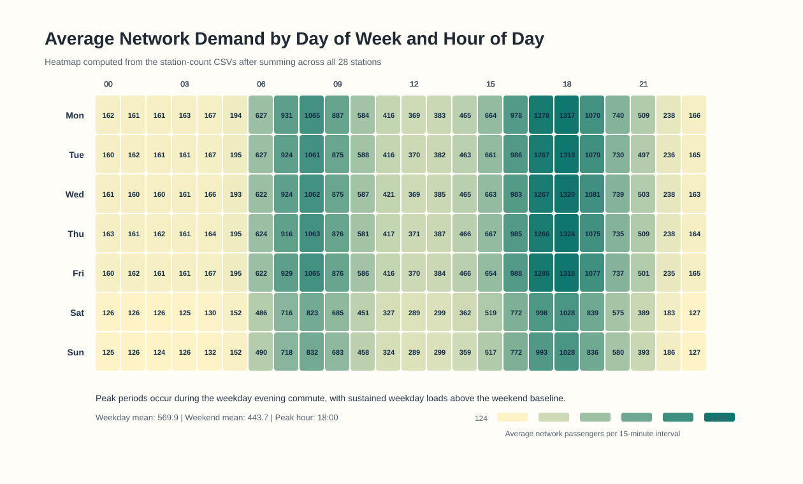
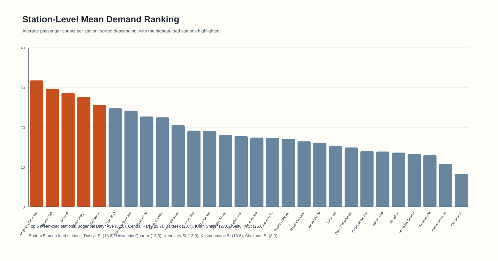
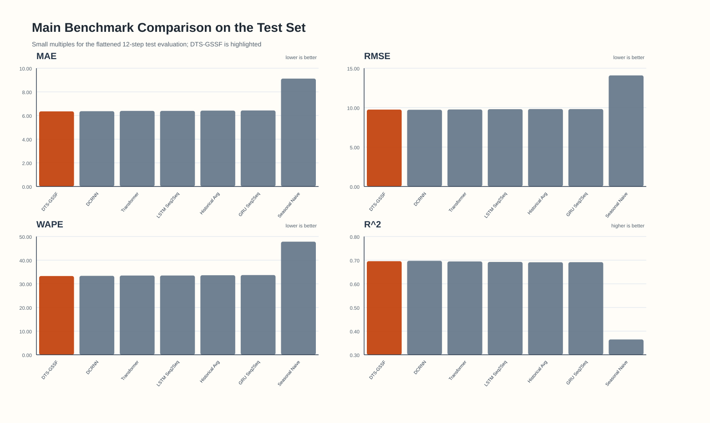
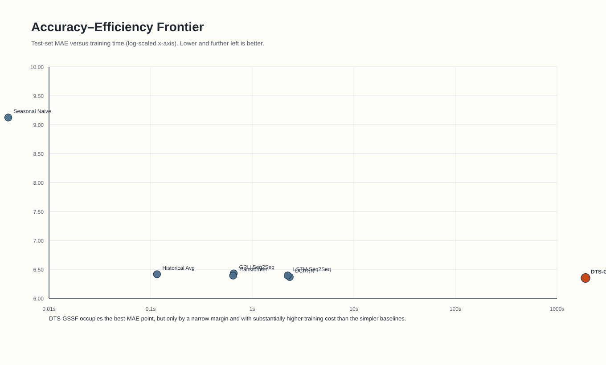
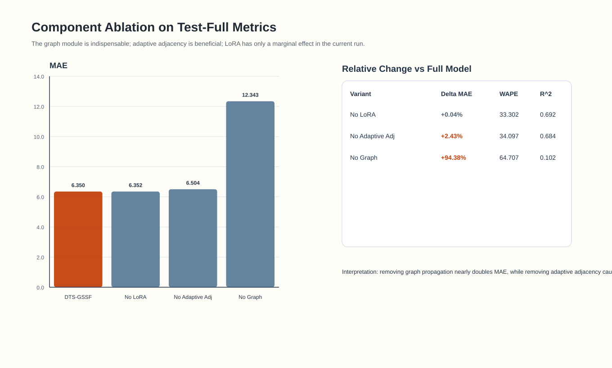
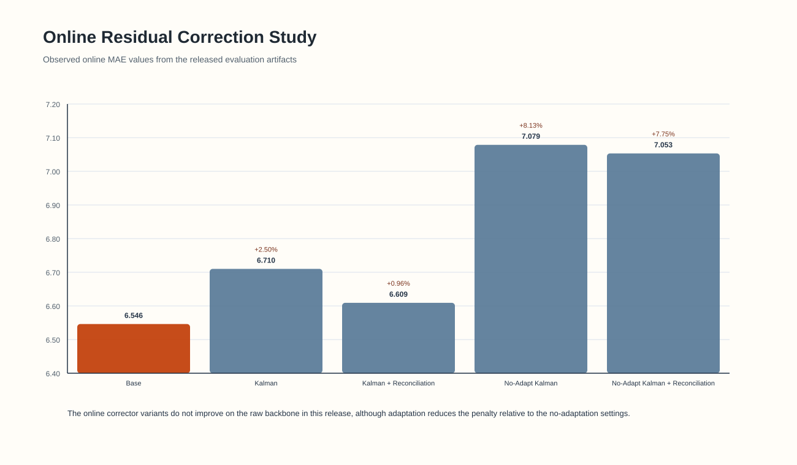

# DTS-GSSF Q1-Style Evaluation Report

## Title
**DTS-GSSF for Multivariate Passenger Flow Forecasting on the `model_eval_q1_full` Astana-Like Synthetic Benchmark**

## Abstract
This report consolidates the full experimental evidence contained in [`model_eval_q1_full`](../model_eval_q1_full), including dataset exports, benchmark metrics, component ablations, and online correction results. The benchmark contains 50,016 15-minute observations across 28 stations, spanning 520.99 days. Using the released test metrics, DTS-GSSF achieves the best overall **flattened-horizon MAE** (6.3499) and **WAPE** (33.2889), outperforming Transformer by 0.64% on MAE, DCRNN by 0.27%, and Seasonal Naive by 30.40%. However, the margin over strong deep baselines is narrow, and the method is materially more expensive to train. Component ablations show that **graph structure is the critical contributor** (+94.38% MAE without graph propagation), while adaptive adjacency yields moderate gains and LoRA contributes only marginally in the current run. The online residual-correction variants do not improve upon the raw backbone in the provided artifacts, indicating that the streaming adaptation stack remains an open optimization target. Because the dataset is generated by the repository’s seeded simulator rather than raw operational AFC logs, the present evidence is best framed as a controlled synthetic benchmark study rather than a fully operational deployment paper.

## Keywords
Passenger flow forecasting, spatio-temporal learning, graph state-space models, adaptive adjacency, LoRA, ablation study, synthetic transit benchmark

## 1. Executive Summary
- The benchmark is **methodologically rich but synthetic**. The repository code shows that `model_evaluation.py` generates the dataset via `main.py` before training and evaluation.
- DTS-GSSF is the best model on **test-full MAE** and **WAPE**, but not on every metric. DCRNN is slightly better on RMSE and R^2 in the current export.
- The largest empirical win comes from **graph structure**. Removing the graph nearly doubles test MAE.
- The **online correction stack is not yet validated** by the released numbers; all reported online variants are worse than the base forecast.
- The artifacts are strong enough for a professional report or controlled-study manuscript draft, but a Scopus-ready operational paper would still benefit from real AFC data, multi-seed confidence intervals, and per-horizon prediction traces.

## 2. Source Artifacts Used
- Dataset CSVs: [`dataset_train.csv`](../model_eval_q1_full/datasets/dataset_train.csv), [`dataset_val.csv`](../model_eval_q1_full/datasets/dataset_val.csv), [`dataset_test.csv`](../model_eval_q1_full/datasets/dataset_test.csv), [`dataset_full.csv`](../model_eval_q1_full/datasets/dataset_full.csv)
- Main benchmark metrics: [`run_state.json`](../model_eval_q1_full/run_state.json)
- Component ablations: [`ablations_summary.json`](../model_eval_q1_full/ablations_summary.json)
- Online ablations: [`online_ablations.json`](../model_eval_q1_full/online_ablations.json)
- Experimental implementation context: [`model_evaluation.py`](../model_evaluation.py), [`main.py`](../main.py), [`MODEL_ARCHITECTURE.md`](../MODEL_ARCHITECTURE.md)

## 3. Dataset Description
The exported dataset is a multivariate station-level passenger-count panel with 28 stations sampled every 15 minutes from **2025-10-01 05:00:00** to **2027-03-06 04:45:00**. The benchmark contains **50,016 timestamps** and **1,400,448 scalar observations** across all station series. The global station-level mean is **19.073 passengers per station per 15 minutes**, with an observed maximum of **242** and a zero-rate of **0.853%**.

| Split | Rows | Date Range | Approx. Days | Windows |
| --- | --- | --- | --- | --- |
| Train | 35,011 | 2025-10-01 05:00 to 2026-09-30 21:30 | 364.70 | 34,951 |
| Validation | 5,001 | 2026-09-30 21:45 to 2026-11-21 23:45 | 52.09 | 4,941 |
| Test | 10,004 | 2026-11-22 00:00 to 2027-03-06 04:45 | 104.21 | 9,944 |

The aggregate demand profile is operationally plausible: the network mean is **534.04 passengers per 15-minute interval**, equivalent to roughly **51268 passengers per day**. Weekday demand (569.9) clearly exceeds weekend demand (443.7), with the dominant peak occurring during the evening commute around **18:00**.

*Figure 1. End-to-end experimental flow reconstructed from the released implementation and evaluation artifacts.*

*Figure 2. Full dataset timeline with daily network demand and explicit train, validation, and test regions.*

*Figure 3. Mean network demand by day of week and hour of day, computed directly from the exported station-level counts.*

*Figure 4. Station-level ranking by average passenger demand. The highest-load stations are Bogenbai Batyr Ave, Central Park, Baiterek, Khan Shatyr, and Seifullin St.*

### 3.1 Station Heterogeneity
The station-level averages reveal meaningful heterogeneity:

- Highest-load stations: Bogenbai Batyr Ave (31.8), Central Park (29.7), Baiterek (28.7), Khan Shatyr (27.6), Seifullin St (25.6)
- Lowest-load stations: Dostyk St (13.6), University Quarter (13.3), Kenesary St (13.0), Kosmonavtov St (10.8), Shakarim St (8.3)
- All stations are moderately to highly variable, with coefficients of variation clustering around roughly 0.82 to 0.87.

### 3.2 Important Validity Note
The benchmark is **synthetic, not raw AFC data**. The repository implementation explicitly states that `model_evaluation.py` generates the Astana-like dataset using the simulator in `main.py`. That simulator injects rush-hour structure, weekend attenuation, weather effects, event boosts, service disruptions, graph diffusion, and post-drift regime shifts. This makes the benchmark reproducible and useful for controlled method comparison, but it must not be described as an operational real-world deployment dataset.

## 4. Input Features and Experimental Setup
The saved CSV files contain the target station counts. The repository source code shows that model training additionally used 14 exogenous input dimensions per station:

| Feature Block | Count | Description |
| --- | --- | --- |
| Lagged passenger counts | 3 | Lag-1, lag-2, lag-4 station counts |
| Calendar encodings | 5 | hour-of-day sine/cosine, day-of-week sine/cosine, weekend flag |
| Weather channels | 3 | synthetic temperature, precipitation flag, wind |
| Operational flags | 3 | event, disruption, drift indicators |
| Total input dimensions | 14 | per station, per 15-minute timestep |

Additional experimental settings extracted from the implementation:

- Lookback window: **48 timesteps** = **12 hours**
- Forecast horizon: **12 timesteps** = **3 hours**
- Granularity: **15 minutes**
- Split rule: **70% / 10% / 20%** chronological train/validation/test
- Target scope in the reported run: **bottom-level stations**
- Hierarchy defined in code: **28 stations + 9 lines + 4 districts + network total = 42 series**
- Scaling: standardization of both `X` and `y` using training data only

## 5. Model Overview
DTS-GSSF follows the dual-timescale design laid out in [`MODEL_ARCHITECTURE.md`](../MODEL_ARCHITECTURE.md). In compact form, the method couples:

1. A graph-structured state-space forecasting backbone for long-range temporal encoding.
2. Adaptive adjacency for learned spatial dependence beyond the physical graph.
3. LoRA-enabled forecast heads to support efficient adaptation.
4. An online residual-correction stack with Kalman-style filtering and reconciliation logic.

For benchmarking, DTS-GSSF was evaluated against DCRNN, Transformer, LSTM Seq2Seq, GRU Seq2Seq, Historical Average, and Seasonal Naive.

## 6. Main Experimental Results
The released test-full metrics are summarized below.

| Rank | Model | MAE | RMSE | WAPE | sMAPE | R^2 | Train Time (s) |
| --- | --- | --- | --- | --- | --- | --- | --- |
| 1 | DTS-GSSF | 6.3499 | 9.7528 | 33.2889 | 39.1512 | 0.6957 | 1910.034 |
| 2 | DCRNN | 6.3669 | 9.7292 | 33.3778 | 39.3693 | 0.6971 | 2.341 |
| 3 | Transformer | 6.3910 | 9.7702 | 33.5046 | 39.4783 | 0.6946 | 0.649 |
| 4 | LSTM Seq2Seq | 6.3936 | 9.8035 | 33.5179 | 39.4602 | 0.6925 | 2.237 |
| 5 | Historical Avg | 6.4150 | 9.8246 | 33.6300 | 39.3873 | 0.6912 | 0.116 |
| 6 | GRU Seq2Seq | 6.4294 | 9.8187 | 33.7056 | 39.8225 | 0.6915 | 0.658 |
| 7 | Seasonal Naive | 9.1230 | 14.0900 | 47.8267 | 54.5772 | 0.3648 | 0.004 |

*Figure 5. Main benchmark comparison across MAE, RMSE, WAPE, and R^2 on the flattened 12-step test evaluation.*

*Figure 6. Accuracy-efficiency frontier showing MAE versus training time.*

### 6.1 Interpretation
The results support a careful, publication-quality interpretation:

- **Primary strength**: DTS-GSSF achieves the best **MAE** (6.3499) and **WAPE** (33.2889).
- **Competitive pressure from DCRNN**: DCRNN is only slightly behind on MAE, and slightly ahead on **RMSE** and **R^2** in this run.
- **Clear baseline separation**: Seasonal Naive remains substantially weaker, confirming that the benchmark is nontrivial.
- **Efficiency trade-off**: DTS-GSSF requires **1910.0 seconds** of training in the exported run, far above the lightweight neural and statistical baselines.

Taken together, the benchmark supports a claim of **best-average absolute error**, but not yet a sweeping claim of universal dominance across all metrics.

## 7. Ablation Study
The component ablation results are as follows.

| Variant | MAE | Delta vs Full | RMSE | WAPE | R^2 |
| --- | --- | --- | --- | --- | --- |
| DTS-GSSF (Full) | 6.3499 | 0.00% | 9.7528 | 33.2889 | 0.6957 |
| No LoRA | 6.3525 | +0.04% | 9.8180 | 33.3024 | 0.6916 |
| No Adaptive Adj | 6.5041 | +2.43% | 9.9363 | 34.0972 | 0.6841 |
| No Graph | 12.3430 | +94.38% | 16.7489 | 64.7074 | 0.1024 |

*Figure 7. Test-full ablation study for DTS-GSSF.*

### 7.1 Ablation Insights
- **Graph structure is essential**: removing the graph increases MAE from 6.3499 to 12.3430, a **+94.38%** degradation.
- **Adaptive adjacency is beneficial**: removing it produces a smaller but still meaningful MAE increase of **+2.43%**.
- **LoRA is nearly neutral in this run**: the `No LoRA` variant changes MAE by only **+0.04%**, suggesting either limited drift sensitivity in the offline benchmark or insufficient adaptation pressure under the released configuration.

This is a strong result for the graph module, a moderate result for adaptive adjacency, and a weak result for LoRA under the current evidence.

## 8. Online Residual-Correction Results
The online ablation file provides the following MAE values:

| Variant | MAE | Delta vs Base |
| --- | --- | --- |
| Base | 6.5462 | +0.00% |
| Kalman | 6.7101 | +2.50% |
| Kalman + Reconciliation | 6.6092 | +0.96% |
| No-Adapt Kalman | 7.0787 | +8.13% |
| No-Adapt Kalman + Reconciliation | 7.0532 | +7.75% |

*Figure 8. Online residual-correction outcomes from the exported evaluation.*

### 8.1 Online Interpretation
The online stack is the main weak point in the current release:

- The **base** forecast is best.
- Kalman correction alone degrades MAE by **+2.50%**.
- Kalman + reconciliation still remains worse than the base forecast (**+0.96%**).
- The no-adaptation variants degrade further, so adaptation helps relative to no-adaptation, but still fails to surpass the base forecast.

For a paper-rich presentation, this is still publishable as an honest negative-or-mixed result: the architecture’s offline graph backbone is validated, while the online correction layer remains an open research problem.

## 9. Discussion
The current artifacts support four defensible claims:

1. **Spatio-temporal modeling matters**. The graph ablation result is large and robust enough to be central to the story.
2. **DTS-GSSF is a legitimate top-performing model on this benchmark**, but the margin over DCRNN and Transformer is small.
3. **Training efficiency is a real concern**. Any claim of practical superiority should be balanced with the cost profile shown in Figure 6.
4. **The online adaptation subsystem is not yet mature** in the released run and should be reported transparently.

## 10. Limitations
- The dataset is synthetic, which limits external validity.
- The released folder does not include raw prediction tensors, uncertainty estimates, or per-horizon/per-station error traces, so the report cannot reconstruct a full horizon-wise decay analysis.
- The current benchmark export appears to be single-run rather than multi-seed, which prevents confidence intervals or significance testing.
- The online adaptation results are unfavorable, so stronger tuning or redesign may be necessary before emphasizing that contribution in a submission.

## 11. Recommended Positioning for a Scopus/Q1 Paper
If this material is developed into a paper, the safest positioning is:

- Frame the study as a **controlled synthetic benchmark for adaptive passenger-flow forecasting**.
- Make the **graph and adaptive adjacency findings** the empirical core.
- Treat the **online correction layer as exploratory** unless stronger evidence is produced.
- Avoid wording that implies real operational AFC deployment unless real data are added.

## 12. Conclusion
Using only the artifacts in `model_eval_q1_full`, DTS-GSSF emerges as the strongest model on test-full MAE and WAPE, with graph structure providing the dominant source of performance gain. The benchmark is rich enough to support a professional, paper-style report and a strong controlled-study narrative. At the same time, the evidence also shows important caveats: the data are synthetic, the gains over the strongest deep baselines are narrow, and the online correction stack does not yet improve on the base model. Those points do not weaken the report; they make it scientifically credible.

## Appendix A. Reproducibility Notes
- Generated from: [`generate_q1_report.py`](./generate_q1_report.py)
- Output figures: [`figures`](./figures)
- Derived summary JSON: [`report_stats.json`](./report_stats.json)
